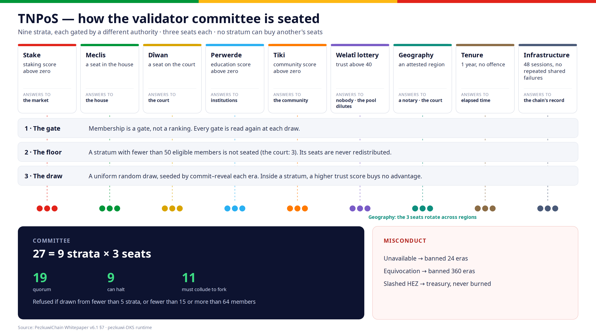

# TNPoS — the validator pool

Nominated proof-of-stake elects the wealthiest set that nomination can assemble.
Over time that is the same set. **TNPoS breaks the correlation by construction**: it
fills the committee from nine independent strata and gives each stratum the same
number of seats regardless of how much stake sits behind it.

**Nine strata × three seats = a committee of 27.**

[{ loading=lazy }](assets/tnpos-committee.png "Open the full-size diagram")

!!! warning "Judge the network on the count of independent gates"
    The security argument rests on the strata being gated by **different**
    authorities — two strata answering to the same institution are one stratum, not
    two. How many are genuinely independent has been changing as the dedicated
    channels land, so this page does not restate the number: it is in
    [the whitepaper](whitepaper.md), which is generated from the source the code is
    written against, and it is published on chain.

## The nine strata

| Stratum | Admits a citizen who has | Answers to |
|---|---|---|
| **Stake** | Any staking score above zero | The market |
| **Meclis** | A seat in the elected house | The house |
| **Dîwan** | A seat on the court | The court |
| **Perwerde** | Any education score above zero | Accredited institutions |
| **Tikî** | Any community score above zero | The community |
| **Welatî lottery** | Trust above forty — more than the cheapest act | Nobody; the pool dilutes |
| **Geography** | An attested belonging to a part of the nation | A notary, undone by the court |
| **Tenure** | A year of unbroken, offence-free membership | Nobody; only elapsed time |
| **Infrastructure** | Forty-eight sessions validated, and no pattern of failing with others | Nobody; the chain's own record |

The third column is the one the security argument counts: two strata answering to the
same institution are one stratum. Geography's three seats rotate across the six recognised
regions (Başûr, Bakur, Rojava, Rojhilat, the diaspora and the Caucasus) rather than
pooling, so the most populous region cannot take all three.

## Membership is a gate, not a ranking

This is what most distinguishes TNPoS from anything score-weighted. Inside a
stratum, a higher trust score buys **no advantage whatsoever**. The score decides
whether you are in the pool; a **uniform random draw** decides whether you sit. The
wealthiest citizen and the barely-qualified citizen have the same chance in the same
stratum.

The draw is seeded by **commit–reveal** across the era: commitments in the first
half, reveals in the second, each era's seed derived from the previous one and the
revealed preimage. No single participant chooses the seed, and the seed for an era
does not exist until that era is under way.

## The floors that refuse a weak committee

A stratum with fewer than **50** eligible members is **not seated at all**, and its
seats are **not redistributed**. The court is the single exception, with a floor of
**three**: its eleven seats can never reach fifty, and they cannot be manufactured the way
eligible members of an open stratum can. A committee is refused if it draws from fewer
than five strata, or has fewer than fifteen members, or more than sixty-four.

Refusing to fill a committee is a safer failure than filling it from whoever happens
to be available: a thin field produces a smaller committee, never a captured one.

## What the committee needs to act

| Committee | Quorum | Halt | Fork |
|---|---|---|---|
| 27 (full) | **19** | **9** | **11** |

Quorum is two thirds plus one. The halt threshold is how many can stop the chain by
abstaining; the fork threshold is how many would have to collude to split it. All are
**derived from the committee size** rather than fixed, so a smaller committee is
honest about being easier to disrupt.

## Misconduct

TNPoS itself touches no funds. Its sanction is exclusion: unavailability bans a
validator for **24 eras**, equivocation for **360**. A ban may only ever be extended,
never shortened, and removal from the committee is immediate.

Economic slashing is the Asset Hub's business, and **nothing is burned** — slashed
HEZ is resolved to the treasury. Burning an inflating token would hand the
confiscated value to everyone still holding it, a quiet dividend paid by the victim
to the bystanders. A penalty should become something the state can spend.

See also **[Institutions](institutions.md)** for how trust is computed, and
**[Staking & Collators](staking.md)** for the economic side.
